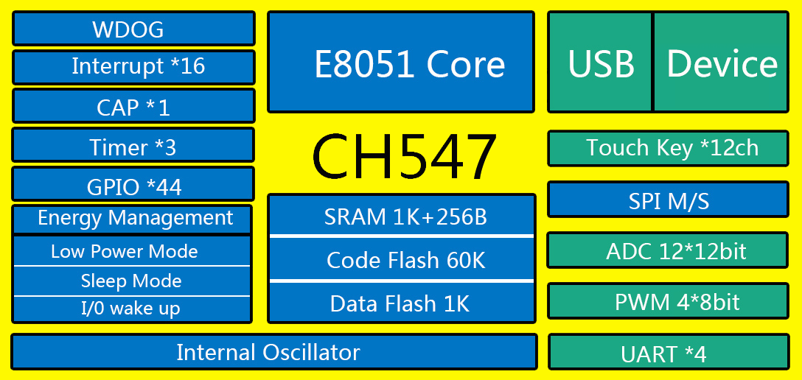

# [CH547](https://github.com/SoCXin/CH547)

#### [Vendor](https://github.com/SoCXin/Vendor)：[WCH](http://www.wch.cn/)
#### [Core](https://github.com/SoCXin/8051)：[E8051](https://github.com/SoCXin/8051)
#### [Level](https://github.com/SoCXin/Level)：48MHz

## [CH547简介](https://github.com/SoCXin/CH547/wiki)

[CH547](https://github.com/SoCXin/CH547) 兼容MCS51的增强型E8051内核，79%指令是单字节单周期指令，3KB BootLoader + 60KB CodeFlash，2K xRAM + 256B iRAM，1K DataFlash。

支持 USB-Host主机模式和 USB-Device设备模式，支持 USB 2.0 全速 12Mbps，支持USB PD和Type-C。内置 FIFO支持最大64字节数据包,支持 DMA。

接口包括4组异步串口、8路PWM和16通道电容触摸按键，其它包括1路主从SPI，16路12位ADC，支持电压比较；内置3组定时器和3路信号捕捉。

内置时钟和PLL，也可支持外部晶振。

#### 关键特性

* USB全速设备模式
* UART x 4 + SPI (M/S)
* 封装(LQFP48/QFN28/SOP16)

### [资源收录](https://github.com/SoCXin/CH547)

* [参考文档](docs/)
* [参考资源](src/)
* [参考工程](project/)

### [选型建议](https://github.com/SoCXin)

[CH547](https://github.com/SoCXin/CH547) 相较于 [CH549](https://github.com/SoCXin/CH549) 去掉了TYPE-C相关功能，没有USB-Host，其余规格相同。

[CH546](http://www.wch.cn/products/CH546.html)降低了flash容量(35K)，没有封装QFN28封装。

###  [SoC.芯](http://www.SoC.Xin)
